# Help Me !

Help Me is website, where you can ask any query and get responses from other users who have knowledge or experience in that domain. Whether you want to learn something new, get advice, share your opinions or just have fun, this is the place for you.

## AmIResponsive

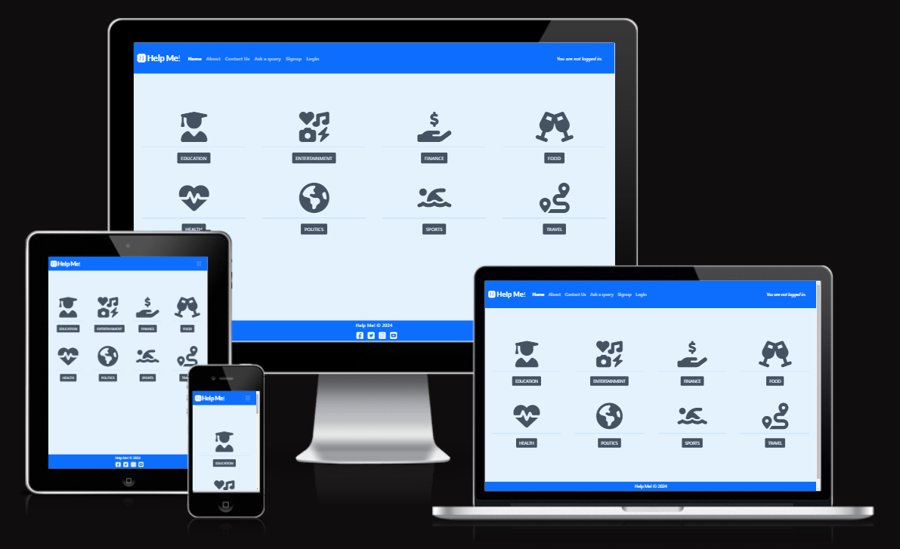

Help Me ! is live, to access it [click here.](https://help-me-038cd18040fa.herokuapp.com/)

## Table of contents

+ [UX](#ux)
+ [Design](#design)
+ [Features](#features)
+ [Testing](#testing)
+ [Technologies used](#technologies-used)
+ [Deployment](#deployment)
+ [Credits](#credits)

## UX

### Site Purpose

Our mission is to create a community of curious and helpful people who can learn from each other and exchange information on various topics. We believe that everyone has something valuable to offer and that by asking and answering questions, we can enrich our knowledge and understanding of the world.

### Audience

Help me is for everyone who have any query or would like to help other users, those have asked queries in different categories like,

- Education
- Entertainment
- Finance
- Food
- Health
- Politics
- Sports 
- Travel  

### Current User Goals

- Ask query
- Respond on a query
- Delete query
- Delete or edit responses
- Add user profile
- Contact admin for suggestion, thoughts

### Future User Goals

- Like, disklike or upvote different queries or response given by other users
- See all users profile
- See all queries asked or response given in a page
- Option to add new categories
- Filter queries or responses
- Upload image in add profile page

## Design

### Color scheme

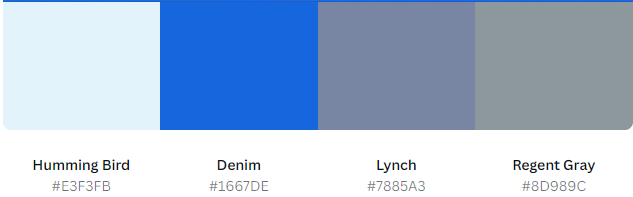

### Typography

Lato font is the major font used in this website for all kind of text with fallback option to sans-serif if the browser don't support the preffered color Lato.

### Agile methodology

Agile project management principles guided the development of this project, leveraging GitHub Projects as the primary software for tracking user stories. Utilizing the Kanban board task view, I crafted a comprehensive user story template that served as the foundation for all project-related narratives. Beyond capturing the core user stories, GitHub Projects played a pivotal role in efficiently monitoring and addressing bugs identified throughout the project's lifecycle. 

### Wireframes

- The separate documetns for the wireframes can be found here:
    <details>
        <summary>Desktop Wireframes</summary>
        <details>
            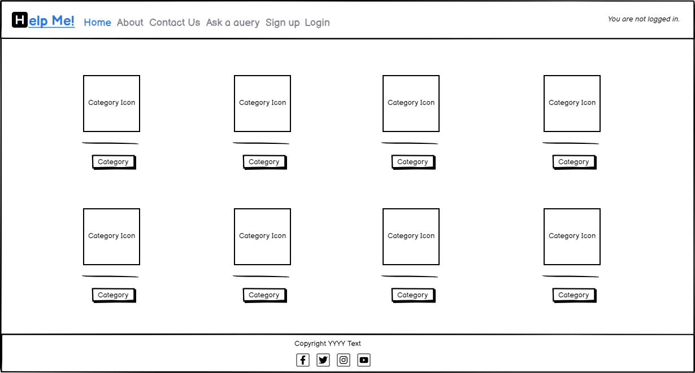
        </details>
        <details>
            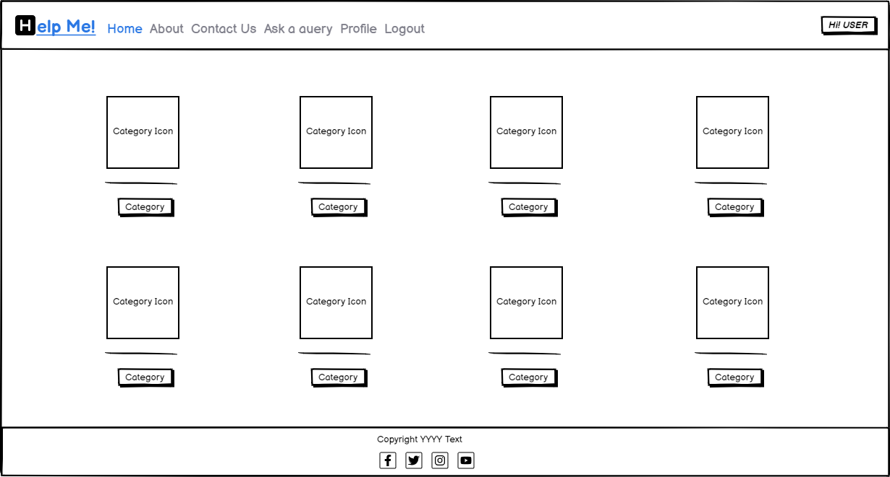
        </details>
        <details>
            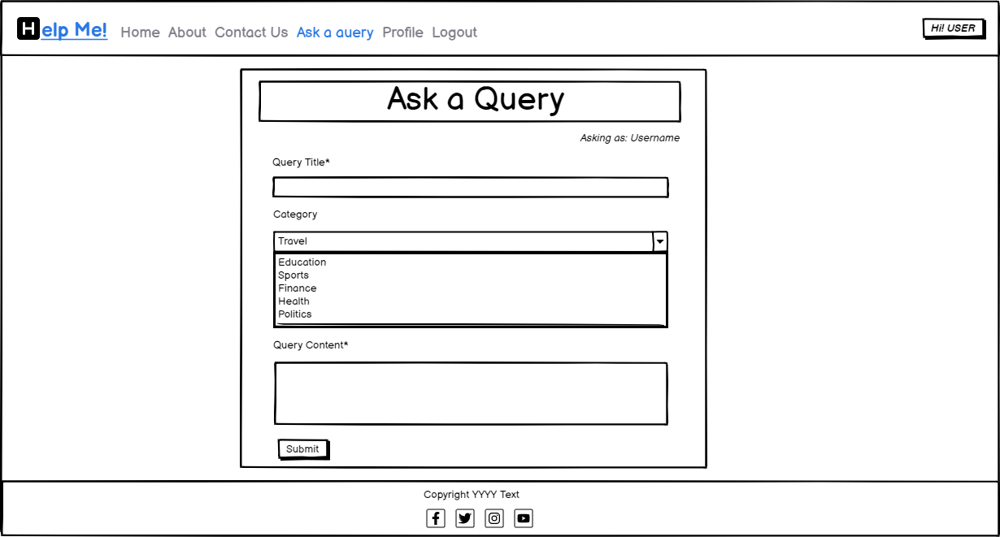
        </details>
        <details>
            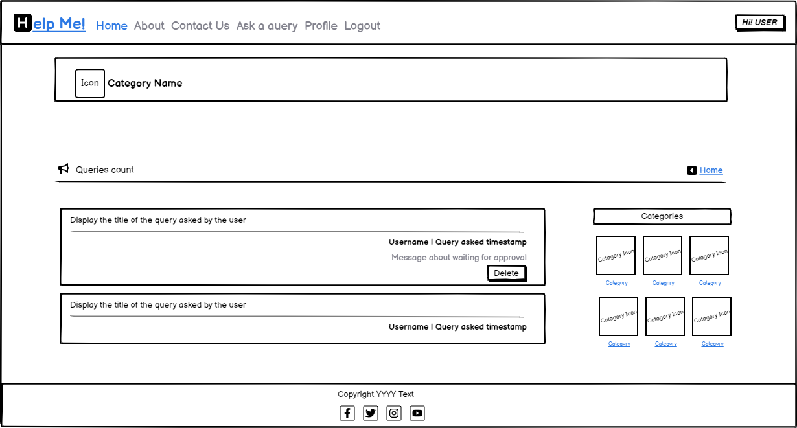
        </details>
        <details>
            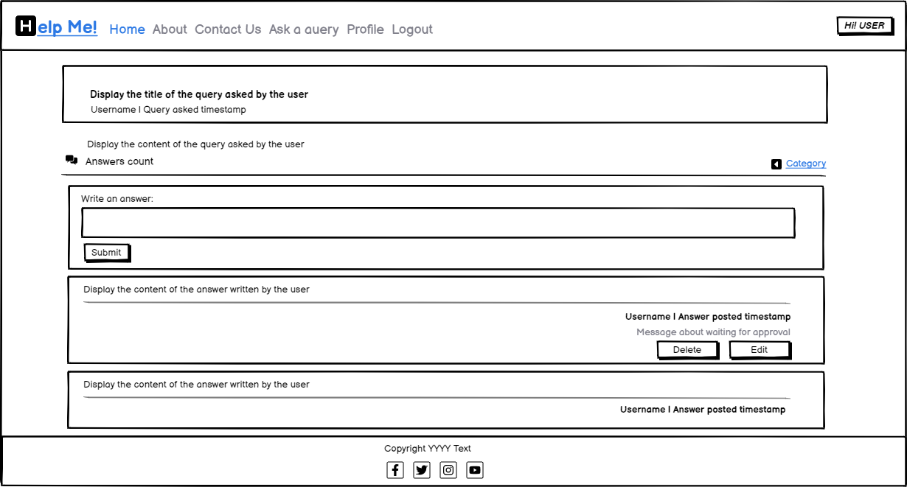
        </details>
        <details>
            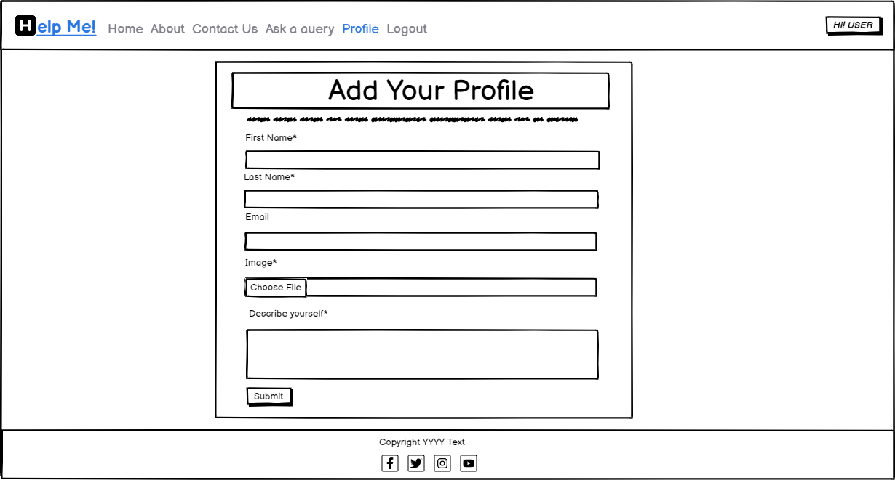
        </details>
        <details>
            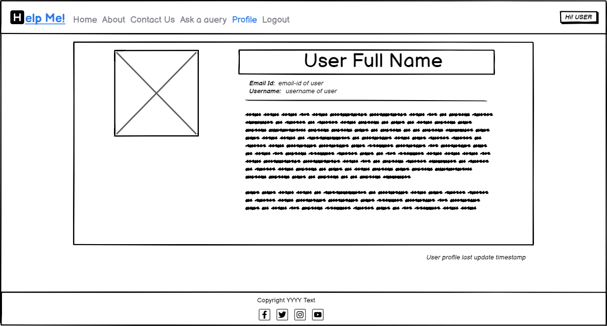
        </details>
        <details>
            
        </details>
        <details>
            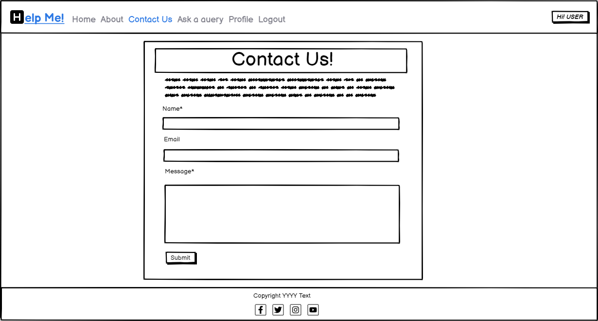
        </details>
        <details>
            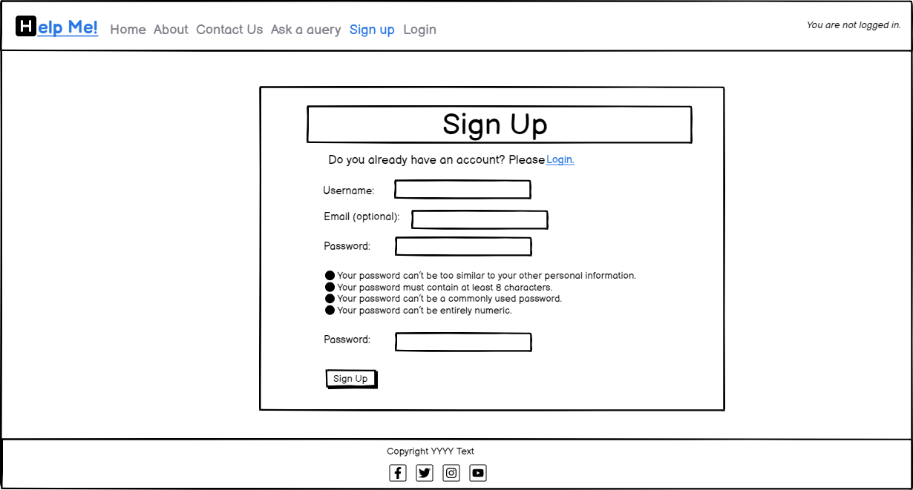
        </details>
        <details>
            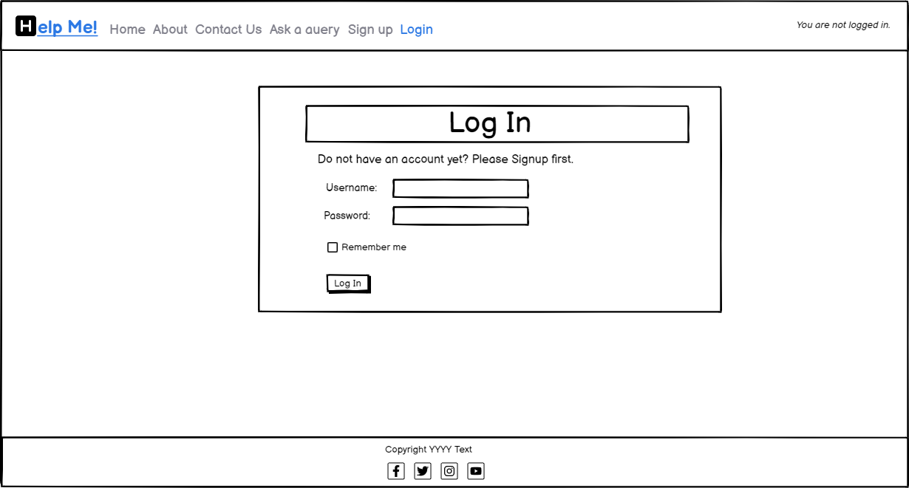
        </details>
        <details>
            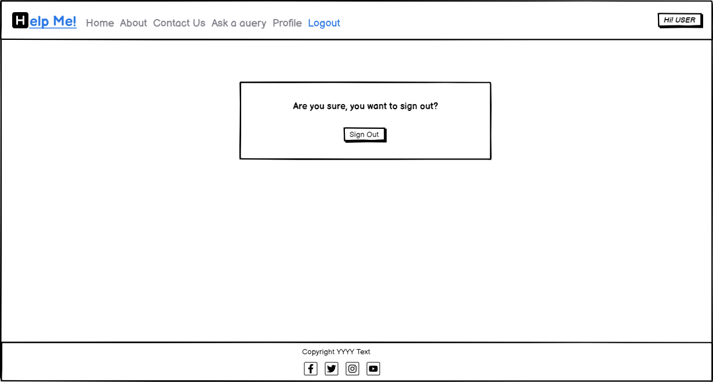
        </details>
        <details>
            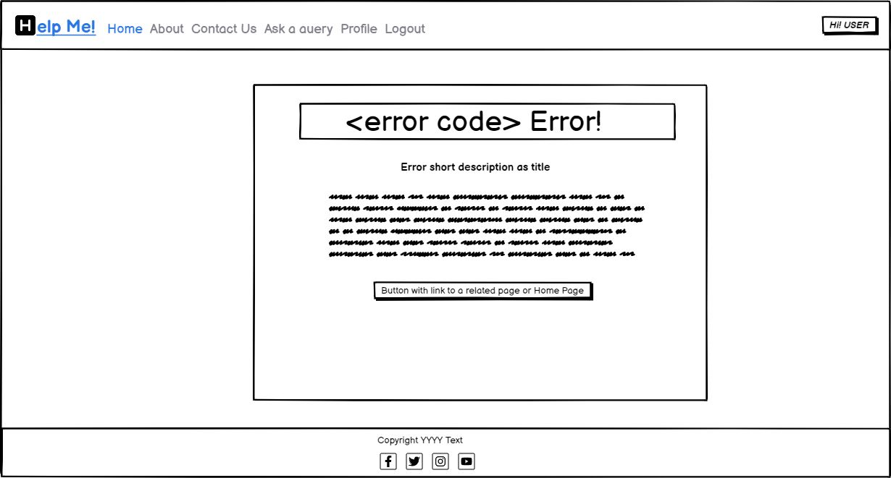
        </details>
    </details>

    <details>
        <summary>Mobile Wireframes</summary>
        <details>
            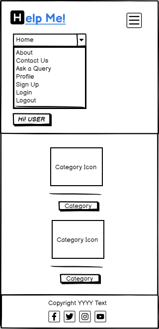
        </details>
    </details>

### Database schema

The database schema is composed by 6 models: Category, Query, Answer, About, User Profile and Contact information. 

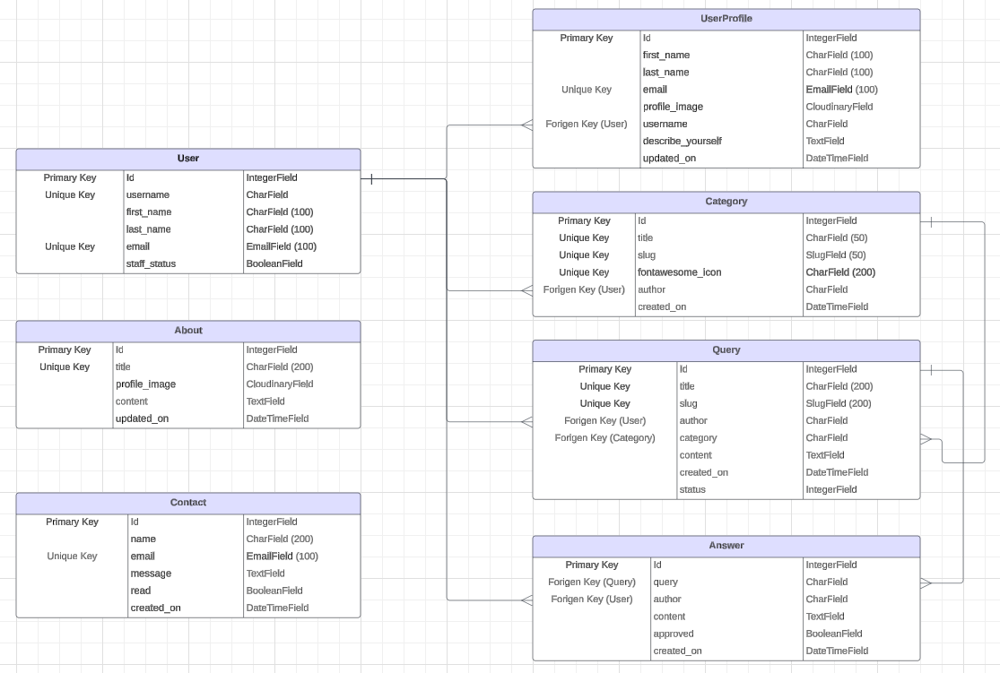

#### Category

This model consist of different categories available on website for which a user can ask or respond to queries. Only admin have access to this model and access to create a new categories. This model have following fields:

- Id: Unique id for each category and it works as primary key for the model.
- Title: A character field that handles category name.
- Slug: A character field and autogenerated with the help of summernotes. This helps in creating the urls and route user to a page where all queries for respective category can be seen.
- Fontawesome_Icon: A character field that handle the fontawesome icons text taken from w3c bootstrap website and fits for visualisation purpose of each category.
- Author: A character field that handle the username, who is adding the category. In current case, its only admin. But, in future goals, I would like to give oppurtunities to site user to add the categories if not exists already. Its a Forigen key to the django User model.
- Created_On: A Datetime field used to store the category creation datetime.

#### Query

This model consist of all queries that any user asks with Foriegn key link to Category model to handle display only queries for respective categories at front end. Site user have access to ask new queries in this model and admin have access to approve the queries to display asked queries to all users. This model have following fields:

- Id: Unique id for each query and it works as primary key for the model.
- Title: A character field that handles query title.
- Slug: A character field and autogenerated with the help of summernotes. This helps in creating the urls and route user to a page where all answer for respective query can be seen.
- Author: A character field that handle the username, who is asking the question based upon the session logged in. Its a Forigen key to the django User model.
- Category: A character field that handle the category for which the query has been asked and aligned to. Its a Forigen key to the Category model.
- Content: A Text field that handle the details view of the query. It has no words limit.
- Created_On: A Datetime field used to store the query creation datetime.
- Status: Its an integer field that is used to set status of the query. The default value is 0 that means Draft and admin can set this value to 1 that means Published and only after the status is set to 1 (Published) by the admin the query asked will be visible to all.

#### Answer

This model consist of all answer that any user writes with Foriegn key link to Query model to handle display only answer for respective query at front end. Site user have access to write answers in this model and admin have access to approve the answer to display answer written to all users. This model have following fields:

- Id: Unique id for each query and it works as primary key for the model.
- Query: A character field that handle the query for which the answer has been given. Its a Forigen key to the Query model.
- Author: A character field that handle the username, who is writing the answer based upon the session logged in. Its a Forigen key to the django User model.
- Content: A Text field that handle the details view of the answer. It has no words limit.
- Approved: Its an boolean field that is used to approve the answer. The default is not approved and admin mark it as approved by clicking the checkbox option on answer from on admin site. Once the answer is approved only after that it will be visible to all.
- Created_On: A Datetime field used to store the answer creation datetime.

#### UserProfile

This model consist of all user profiles that any logged in user create for itself. The user has been identify with the help of django user model to display the correct profile at front end. Site user have access to write information about its profile in this model and admin have access to upload the image for user profile. This model have following fields:

- Id: Unique id for each query and it works as primary key for the model.
- First_Name: A character field that handle the first name of the user.
- Last_Name: A character field that handle the last name of the user.
- Email: An email field that handle the email address of the user.
- Profile_Image: A Cloudinary field that handles the image uploaded by the admin for the user.
- Username: A character field that handle the username, who is writing its profile based upon the session logged in. Its a Forigen key to the django User model.
- Describe_Yourself: A Text field that handle the details view of the description the user write about itself. It has no words limit.
- Updated_On: A Datetime field used to store the last updated datetime.

#### About

This model consist of all about us information of this website. Only admin can update this model. This model have following fields:

- Id: Unique id for each query and it works as primary key for the model.
- Title: A character field that handle the Title for the about us page.
- Profile_Image: A Cloudinary field that handles the image uploaded by the admin for about us page.
- Content: A Text field that handle the details view of the description the admin writes about the website. It has no words limit and summernotes are used to store the data in rich text format.
- Updated_On: A Datetime field used to store the last updated datetime.

#### Contact

This model consist of all contact us information of when a site user writes to the admin. Any site user can update this model regardless of the user is logged in or not. This model have following fields:

- Id: Unique id for each query and it works as primary key for the model.
- Name: A character field that handle the name of the user who is trying to contact the admin.
- Email: An email field that handle the email address of the user.
- Message: A Text field that handle the details view of the message the user writes about the website admin. It has no words limit.
- Read: Its an boolean field that is used to mark the message as read by the admin. The default is not read and admin mark it as read by clicking the checkbox option on contact from on admin site.
- Created_On: A Datetime field used to store the contact message creation datetime.

## Features

### Common Features

#### Language Used

- Django
- Python
- HTML5
- CSS3
- Javascript

#### Navbar

- On large screens, the navbar displays brand icon and name along with links to Home, About, Contact Us, Ask a query. If user is not logged in it displays the Sign Up and Login links too. Also, on right corner a message dispalys that user is not logged in.

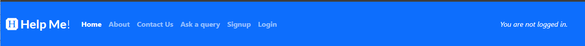

- When the user is logged in apart from showing the navbar displays brand icon and name along with links to Home, About, Contact Us, Ask a query the Profile and logout links are dispalyed too. Also, on right corner a Hi username message display with some stylized view.

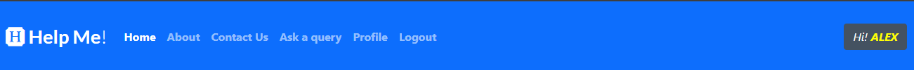

- In small screens, all links are placed within a burger menu. The brand name and icon display outside the collapseable burger menu. 

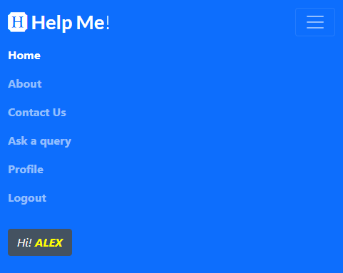

#### Footer

- Users have functional links to X (Twitter), Instagram, and YouTube. These links will open in a new tab as they are outside the web application. 


#### Index

- Three carousel images are displayed on the home page. 
- Due to the size of the different screens, landscape images were used for large screens while portrait images were used for small screens.
- The initial page contains catchy titles and functional links to the posts board and About Us pages.


- The second page encourages users to create an account and provides links to sign-up or login.


- The third page provides a brief background about the application and offers a link to "Learn More," redirecting to the About Us page. Additionally, there is a "Contact Us" link that directs users to the contact form. 


#### About us 

- This is an informational page that includes a brief description of the forum, explains what a user can do on the platform, and features catchy content at the end. Additionally, it provides buttons to redirect the user to the posts board and to sign up.


#### Contact

- This page contains a form for a user to directly contact the admin. The fields include first name, last name, email, phone number, subject, and message. 


- If the form is invalid, error messages will be displayed. 


- If the form is successfully submitted, it will redirect the user to a success landing page where they have buttons to go back home. If they are not authenticated, they can sign up. 


#### Board 

- Post Creation Form: This is where users can create a post. They can enter a title, country, choose from dropdowns for holiday type and world area, and provide the content of the experience.  


- All posts need to be approved; therefore, after a post is successfully submitted, a success message is displayed, stating that the post has been received and is awaiting approval.


- When a user is not authenticated, they cannot create posts. Therefore, instead of displaying the create post form, a card is shown explaining that they need to have an account to create posts.


- All approved posts are displayed on the board page. A post is comprised of the user who wrote it, the time since the post was created, post title, holiday type, location, country, and content.


- Additionally, the post have 3-4 buttons: 
    - The post author is a link that redirects the user to the author's profile. 

    

    - The like button changes appearance; when a post is unliked, it shows an empty heart, and when liked, it displays a solid heart. Additionally, it increases or decreases the like count.

    

    

    - The comment button is a toggle button that reveals a text area for users to comment on the post.

    

    - When the user is not authenticated, they cannot like or comment on a post. In this case, both buttons work as toggles to display a message that the user needs to have an account to like or comment on a post.

    

    - Options Button: This button is only displayed in posts where the authenticated user is the author of the post. The options button is a dropdown menu that presents two choices: edit post and delete post.

    

- Comment Submission: All comments need to be approved by the admin. Therefore, after a comment is submitted, a success message is displayed, indicating that the comment is awaiting approval.


- Displayed Comments: After comments have been approved, they are shown below the post, indicating the author and the time since the comment was made. The username is also a link to the user's profile.


- Edit Post: When the authenticated user wants to edit their post, a modal with the edit post form is displayed.


- As the content needs to be reviewed, a success message is displayed when a post has been edited, indicating that it is awaiting approval.


- After the edited post is approved, an '(edited)' text is added in italics below the main content of the post to indicate that it has been edited.


- Delete Post: When the authenticated user clicks on the delete post option, the delete post modal is displayed, asking the user for confirmation if they want to delete the post with the specific title.


- When the post is deleted, a success message is displayed, indicating that the post has been deleted.


- Filter Posts: On large screens, the filter post card is displayed on the left-hand side and is stuck to the top of the page. The user can filter posts based on the world area or holiday type. The card includes a clear filter button to remove all selected filters and an apply filters button to activate the chosen filters, reload the page, and display only the posts with the selected filters.


- In smaller screens, the filter card is not displayed. Instead, a small button is placed between the create post form and the posts.


- When clicked, the filter button will open the filter card as a modal, allowing the user to successfully filter posts on small screens.


#### Registration (Authentication)

- When not authenticated, users can create an account using a unique username and password.


- When the user attempts to create an account with an existing username, a password that does not fulfill the requirements, or if the passwords do not match, an error is displayed in the form.


- Login Page: A user can log in to the application by inputting their username and correct password.


- If, when logging in, the user inputs an incorrect username or password, the form will display the error.


- Logout Page: Here, the application asks the user for confirmation before logging out. 


#### Create profile 

- After a user signs in for the first time, they are redirected to the create profile page. This page does not contain navigation links, as its purpose is to encourage the user to complete their profile.


- The create profile form has form validation features and displays errors if a field is left blank or filled incorrectly.


- If the form is valid, the user is redirected to their user profile page, where they see a success message stating that their profile has been created. 


- If the user chooses not to complete their profile creation and navigates elsewhere within the app using the URL bar, their profile will not be accessible to either themselves or other users.

    - If the user attempts to access their profile without having completed it, a card will display explanatory information and include a link directing them to the profile creation form.

    

    - In the event that another user attempts to access the profile, a card will appear, providing an explanation of the situation and offering links to either the community board or the user profile.

    

    - If an unauthenticated user attempts to access a profile, a card will be displayed, offering a similar explanation. However, instead of providing an option to visit the profile, it will feature a button prompting the user to sign up.

    

#### User profile

- The main difference between the user profile and the posts board is that there is no possibility of filtering posts; all displayed posts belong to the user, and a card with the user's profile information is visible. 
- When the authenticated user is on their profile, they can create posts and also edit their profile by clicking the 'Edit Profile' button. 


- If the user does not have any posts, a message will be displayed stating that the user has no posts
- When the authenticated user is on another user's profile, they are not able to edit that user's profile, as the 'Edit Profile' button is not displayed. Additionally, they cannot create posts. An explanation is provided with links to the board page or their own profile. 


- When a non-authenticated user is on a user's profile, they cannot see the user's profile information and cannot create a post either.


- Edit Profile: When the user wants to edit their profile, a modal is opened, and all the fields are pre-filled with the existing profile information.


- If the edit profile form is successfully submitted, a success message is displayed, stating that the profile has been updated.


- In the edit profile modal, there is also a delete profile button. This button will open another modal that will ask for confirmation from the user about deleting their profile.


- If the user decides to delete their profile, they will be logged out, and their posts, comments, user profile information, and login credentials will be permanently deleted from the application.


- The posts and post buttons have the same functionality as described in the [board section](#board).

### Future Features

- Asynchronous behaviour
    - When a post is liked or commented on, the page is automatically reloaded. A future feature is planned to avoid reloading the page when these actions are taken by the user.

- Post information datamodel
    - The idea of world areas and holiday types is good for filtering and differentiating posts, but additional details such as country and author could enhance this feature
    - The country should be implemented as another dropdown list with the countries selected based on the chosen world area.

- Further relevant feedback
    - Remove the sign-in and sign-out messages.
    - Implement notifications to inform users when their posts or comments have been approved.
    - Implement notifications for when another user has commented or reacted to a post.
    - Implement notifications for when a comment is added to a post a user has commented on.

## Testing

### Methodology 

Testing was an integral part of the project development, encompassing the use of Django debug pages and strategically placed print statements to verify the functionality of the code at various stages. Furthermore, a comprehensive testing approach was adopted, outlined below. This involved meticulous manual testing to ensure alignment with all user stories and acceptance criteria 

#### Index page

| Testing  | Steps | Expected Outcome | Results |  
| - | - | - | - |
| Navigation bar functionality (user not authenticated) | Click all available links | User is directed respectively to the home, about us, board, contact or account registration links | PASS |
| Navigation bar functionality (user authenticated) | Click all available links | User is directed respectively to the navbar links and has the correct account links (profile and logout) | PASS |
| Footer links | Click all available links | User is directed respectively to all social media links with  | PASS |
| Carrousel links | Click all available links | User is directed respectively to all social media links with  | PASS |

#### About us page

| Testing  | Steps | Expected Outcome | Results |  
| - | - | - | - |
| "Start Exploring" and "Join us" buttons | Click all available links as authenticated and unauthenticated user | User is directed succesfully to the post board page and to the signup page when not authenticated. | PASS |

#### Board

| Testing  | Steps | Expected Outcome | Results |  
| - | - | - | - |
| Filter post functionality | Test multiple filters from a single category and both categories. Clear filters button clear all selected filters.  | Post are successfully filter depending the applied filters. The clear filter button clears all selected filters. | PASS |
| Sign-in button display and functionality (user not authenticated) | Access as an unauthenticated user and try to login or signup with the card links.  | Card successfully displays button and the button redirects to sign-in page | PASS |
| Like and comment buttons (user not authenticated) | As an unauthenticated user try to like or comment a post. | The buttons successfully toggle the login request message and the login link redirects to the login page. | PASS |
| Create post form (user authenticated) | Access the main board as an authenticated user. | When user is authenticated, the create post form is successfully displayed with the correct sign-in user at the top | PASS |
| Create post form - Form validation | Submit an empty form | The browser promts validation that all fields need to be filled. | PASS |
| Create post form - Form validation | Submit an form with an existing title. | An error message is displayed, stating that there is already a post with that title. | PASS |
| Create post form - Form validation | Submit an incomplete form. | The browser promts validation that all fields need to be filled. | PASS |
| Create post form - Form validation | Submit a complete post. | The post is successfully submited and a success message is displayed, stating that the post is awaiting review. | PASS |
| Post buttons - profile button | Click on the post author name to be redirected to the author's profile. | The button successfully redirects to the correct user profile page. | PASS |
| Post buttons - Like button | Try to like and unlike posts. | The button successfully adds or substracts the number of likes and the heart icon changes depending on the like status for that user. | PASS |
| Post buttons - Comment button | click the comment button in each post. | The button successfuly toggles the comment area and the submit comment button. | PASS |
| Post buttons - Options dropdown button (user authenticated is the post author) | As the author check if the options button is displayed. | The button is successfully displayed for posts where the authenticated user is the author but is not displayed for posts where the authenticated user is not the autor. | PASS |
| Comment form - Form validation | Submit an empty comment. | The browser promts validation that all fields need to be filled. | PASS |
| Comment form - Form validation | Submit a comment. | The comment is successfully submited an a success message is displayed, stating that the comment is awaiting review. | PASS |
| Post options - Edit post | As a post author click the edit post button under post options. | When the authenticated user is the author, it successfully displays the edit post modal when clicking the edit post option. | PASS |
| Post options - Delete post | As a post author click the delete post button under post options. | When the authenticated user is the author, it successfully displays the delete post modal when clicking the delete post option. | PASS |
| Edit post - Form validation | Submit an empty form. | An error message is displayed, stating that fields are are required. | PASS |
| Edit post - Form validation | Submit an incomplete form. | An error message is displayed, stating that all fields are are required. | PASS |
| Edit post - Form validation | Submit an valid form. | A success message is displayed, stating that the post was successfully received and is awating for approval. | PASS |
| Delete post functionality | Click on delete post. | The post is successfully deleted and a success message is displayed confirming tha the post has been deleted. | PASS |
| Edit post display | Edit a post and wait for admin approval. | The (edited) message is successfully displayed below the post content after this is edited an approved. | PASS |

#### Contact 

| Testing  | Steps | Expected Outcome | Results |  
| - | - | - | - |
| Contact form - Form Validation | Submit empty form | Browser promts that required fields need to be filled | PASS |
| Contact form - Form Validation | Submit empty form (after filling and deleting the field's content) | Browser promts that required fields need to be filled | PASS |
| Contact form - Form Validation | Submit with an invalid email address | Error message is successfully displayed | PASS |
| Contact form - Form Validation | Submit valid form | User is redirect to success page stating that the response has been recorded | PASS |
| Contact form success links | Test the Sign up and home links functionality | User is successfully redirected to signup or home page | PASS |

#### Registration 

| Testing  | Steps | Expected Outcome | Results |  
| - | - | - | - |
| User sign-up page  | Page should display the sign up form. | User is successfully directed to the signup page and sees the signup form. | PASS |
| User sign-up - Form validation  | Submit an empty form. | Browser promts that required fields need to be filled. | PASS |
| User sign-up - Form validation  | Submit an incomplete form. | Browser promts that required fields need to be filled. | PASS |
| User sign-up - Form validation  | Submit an invalid password. | Form promts the errors in the password. | PASS |
| User sign-up - Form validation  | Submit non-matching invalid password. | Form promts the error. | PASS |
| User sign-up - Form validation  | Submit an exisiting user name. | Form promts that the username is already taken error. | PASS |
| User login page  | Page should display the login form. | User is successfully directed to the login page and sees the login form. | PASS |
| User login page - Form validation | Submit an incorrect username password. | Form promts that the username and/or password is not correct. | PASS |
| User logout page  | Page should display the logout form. | User is successfully directed to the logout page and sees the logout form. | PASS |
| User logout page - Form validation | Click in logout. | User is successfully logged out and a display message is displayed at the top. | PASS |

#### Create profile

| Testing  | Steps | Expected Outcome | Results |  
| - | - | - | - |
| Create profile page redirection  | Create a new user (signup) and get redirected to "create profile" | A new user is successfully redirected to the create profile page that displays the create profile form. | PASS |
| Create profile - Form validation | Submit an empty form. | Browser promts that required fields need to be filled. | PASS |
| Create profile - Form validation | Submit an incomplete form. | Browser promts that required fields need to be filled. | PASS |
| Create profile - Form validation | Submit letters in the countries visited field. | Browswer does not allow letters in this field. | PASS |
| Create profile - Form validation | Submit a valid form. | User is redirected to their profile and a success message is displayed. | PASS |

#### User profile

| Testing  | Steps | Expected Outcome | Results |  
| - | - | - | - |
| Profile display - Authenticated user's profile  | Access the own profile. | The authenticated user successfully sees their profile information and the edit profile button. | PASS |
| Profile display - Authenticated user navigating another user's profile  | Try to access another user profile with an authenticated account. | The authenticated user successfully sees other user profile and their profile information. | PASS |
| Profile display - Non authenticated user navigates to a user profiles  | Try to access another user profile without an authenticated account. | The non-authenticated user cannot see the user information and the login link successfully redirects to the login page. | PASS |
| Profile display - profile not created, authenticated user | Create a new user, skip the create profile form and try to access the profile. | The profile is not displayed, a card informs the user that a they need to create their profile and a link to create profile form is provided. | PASS |
| Profile display - profile not created, other authenticated user | With another user try to access the a non-completed profile. | The profile is not displayed, a card informs the user that a they need to create their profile and a links to the main board and profile is provided. | PASS |
| Profile display - profile not created, non-authenticated user | As a non-authenticated user try to access the a non-completed profile. | The profile is not displayed, a card informs the user that a they need to create their profile and a links to the main board and signup is provided. | PASS |
| Edit profile button | Click the edit profile button. | When clicking the edit profile button, the edit profile modal is successfully displayed with the field's prefilled with the exisiting information. | PASS |
| Edit profile form - Form validation | Submit an empty form. | Browser promts that required fields need to be filled. | PASS |
| Edit profile form - Form validation | Submit an incomplete form. | Browser promts that required fields need to be filled. | PASS |
| Edit profile form - Form validation | Submit a valid form. | The profile is successfully updated an a success message is displayed to provide feedback to the user. | PASS |
| Delete profile | Click the delete profile button in the edit profile modal. | The delete profile modal is successfully displayed. | PASS |
| Delete profile - Functionality | Confirm profile deletetion in delete profile modal. | The delete profile feature successfully logs out the user and deletes the user from the databse. | PASS |
| Post form display - Authenticated user's profile | Access the own profile. | The post form is successfully displayed for the authenticated user to create a post from their profile page. | PASS |
| Post form display - Authenticated user in another user's profile | Access another user profile as an authenticated user. | The post form is not displayed and a card with the board and profile buttons is displayed. Both the board and the user profile links are wired correctly. | PASS |
| Post form display - Non-authenticated user in a user's profile | Access another user profile as an unauthenticated user. | The post form is not displayed. | PASS |
| Posts display - User with existing posts | Access a user profile that contains posts. | All user posts are successfully displayed. | PASS |
| Posts display - User with no existing posts | Access a user profile that does not contains posts. | Message is displayed succeessfuly for when an user do no have any posts. | PASS |

### Testing user stories from UX section 

As the exisitng and new users will have the same user experience for the app besides signing up and creating their profile from scratch, these will be groupped. 

#### All users

- Learn about the community.
    - The about us page contains all the relevant information regarding the platform, what the users can do and buttons that redirect to a signup page and the post board.
- Send questions to the community administrators
    - The contact page contains a form where the authenticated or no-autheticated users can send a question to the administrator. All received responses are logged into the web application database.  
- See posts and comments
    - All users, authenticated or no-authenticated can see approved posts and comments.
- Filter exisitng posts
    - All users, authenticated or no-authenticated can see filter posts.

#### Existing and Future User Goals

- Create travel posts
    - Users can create posts and receive feedback if the post is not successfully submitted or if it is.
- Edit posts
    - Users can edit their own posts.
- Delete posts
    - Users can delete their own posts.
- Comment on posts
    - Users can comment on posts.
- Like/dislike posts
    - Users can like or dislike posts.
- Login
    - Users can login to the platform to access to all the web application features.
- Logout
    - Users can logout to restric access to their accoutns.
- Edit their profile
    - Users can change their profile description. 
- Delete their profile
    - Users can delete their profile permantly from the web application. 

#### Future User Goals

- Sign-up
    - Users can create an account in the web application.
- Create their profile
    - Users are redirected to a create profile form just after they sign up in the web application. 

### Validator testing 

- I tested the board.html and userprofile.html files. They both get 39 and 33 errors that are related to djnago curly brackets sytnax. [W3C validator](https://validator.w3.org/#validate_by_uri) with no issues.

- style.css file passed through the [Jigsaw Validator](https://jigsaw.w3.org/css-validator/#validate_by_input) with no issues. 


- script.js passsed through the [jshint validator](https://jshint.com/) by only displaying the let vs var at the moment of declaring variables. 


- The views.py file passes through the [PP8 validator](https://pep8ci.herokuapp.com/#) with no issues except by the trailing whitespaces and the continuatin line is unde-indented. 

- Page has an excellent Accessibility rating in Lighthouse. 

INPUT 

- The python file passes through the PP8 validator with no issues except by the more than 79 characters per line recomended by PEP 8.
- Tested the site opens in Chrome, Safari and Mozilla. 
- No broken links

## Technologies used

### Programming languages

- HTML5
- CSS3
- JavaScript (jQuery)
- Python (Django)

### Frameworks, Libraries and programs used

- [Google Fonts](https://fonts.google.com/) 
- [Bootstrap 5](https://getbootstrap.com/docs/5.3/getting-started/introduction/)
- [Github](https://github.com/juanovt10)
- [CodeAnywhere](https://id.codeanywhere.com/realms/default/protocol/openid-connect/auth?client_id=dashboard&redirect_uri=https%3A%2F%2Fapp.codeanywhere.com%2F&state=0ed650a0-13c7-4f57-8415-5704cc42250e&response_mode=fragment&response_type=code&scope=openid&nonce=2b3f7872-fc80-4c91-bc06-4850e0415d4b)
- [Gitpod](https://gitpod.io/workspaces)
- [Heroku](https://id.heroku.com/login)
- [Realtime Colors](https://www.realtimecolors.com/?colors=e6eef8-03060a-92b3de-262376-694cc9&fonts=Poppins-Poppins)
- [Django](https://www.djangoproject.com/)
- [Django databases](https://docs.djangoproject.com/en/5.0/ref/databases/)
- [Django cloudinary storage](https://djangopackages.org/packages/p/django-cloudinary-storage/)
- [Django-allauth](https://docs.allauth.org/en/latest/)
- [Guinicorn](https://gunicorn.org/)
- [Psycopg](https://www.psycopg.org/docs/)
- [Balsamiq](https://balsamiq.com/) - For wireframes 
- [Lucidchart](https://lucid.app/users/login#/login) - For database diagram 

## Deployment

### Forking the Github repository 

1. Go to [Track Tales Repository](https://github.com/juanovt10/tracktales-blog)
2. In the top right, click the "Fork" button.
3. There will now be a copy of the repository in your own Github account.

### Running the project locally

1. Go to [Track Tales Repository](https://github.com/juanovt10/tracktales-blog)
2. Click on the "Code" button.
3. Choose one of the following three options and click copy.
    - HTTPS
    - SSH
    - Github CLI
4. Open termina in your preferable IDE (cloud or local).
5. Type `git clone` and paste the URL that was copied in step 3. 
6. Press enter and the local close will be created.

### Deploying with Heroku

The following steps were taken from the Django "I think before I blog" walkthrough project provided by [Code Institute](https://codeinstitute.net/global/).

1. Login or create an account in [Heroku](https://id.heroku.com/login). 
2. Go to your dashboard on the top right and click the `New` dropdown button and select `Create New App`.
3. Enter a name of the project (must be unique).
4. Select the region your are working in. 

#### External database set up

I used [ElephantSQL](https://www.elephantsql.com/) as my database. 

1. Login or create an account. 
2. In dashboard on the right top corner click `Create New Instance`
3. You will be forward to a `Select a plan and name`:
    - `Name` should be the name of the project
    - `Plan` should be the type of subscription you have with ElephantSQL, in my case I used the `Tiny Turtle (Free)` plan.
    - `Tags` can be left in blank

    Then click on `Select Region`.

4. Here selecte your `Data center`. This is hosted with AWS. In my case due to my location I used `EU-West-1 (Ireland)`. Please note that you should select an AWS Availability Zone (AZ) closest where your main users will be located to reduce downtime.

    Then click `Review`.
5. Here you will check the name, cloud provider and region where the application will be hosted. If, everything is correct, click `Create instance`.
6. Go to dashboard and your instance will be there. Click in the name and under `Details` copy the `URL`, this will be values that will be needed for the [Heroku variables setup](#heroku-settings) and the [env.py](#envpy-file-set-up) file.

#### External storage set up

I used [Cloudinary](https://cloudinary.com/ip/gr-sea-gg-brand-home-base?utm_source=google&utm_medium=search&utm_campaign=goog_selfserve_brand_wk22_replicate_core_branded_keyword&utm_term=1329&campaignid=17601148700&adgroupid=141182782954&keyword=cloudinary&device=c&matchtype=e&adposition=&gad_source=1&gclid=Cj0KCQiAm4WsBhCiARIsAEJIEzUYoKHM06ldJtPMxUmtjFK3HxOkfQI3_8G9vOXPuRsPWuCVCSFEPzsaAjiJEALw_wcB) as cloud storage for this project. 

1. Create and account or login. 
2. Go to `Dashboard` and copy the `API Environment variable`.
3. This URL will be required when setting up the [env.py](#envpy-file-set-up) and the [Heroku variables](#heroku-settings). 

#### env.py file set up

1. In the root directory of your project create a new file called `env.py`.
2. Add this `env.py` file to your `.gitignore` file so the confidential information in the file is not push to Github.
3. In the `env.py` file import the `os` module and add the [database URL](#external-database-set-up).

```
os.environ["DATABASE_URL"]="<copiedURL>"
```

4. Then, using the same process create a `SECRET_KEY`. This can be anything, I used [RandomKeygen](https://randomkeygen.com/) to create a complicated key. 

```
os.environ["SECRET_KEY"]="<copiedGeneratedKEY>"
```

5. Then, using the same process, in the `env.py` file import the `os` module and add the [storageURL](#external-storage-set-up).

```
os.environ["CLOUDINARY_URL"]="<copiedCloudinaryURL>"
```

6. Save the file.

#### Heroku settings 

After the application is created in Heroku. Got to your dashboard and you will see the application name, click on it and then follow the following: 

1. Go to the settings tab and go to `ConfigVars` and click on `Reveal Config Vars` and set the following variables: 
    - Key: `PORT`, Value: `8000`
    - Key: `DATABASE_URL`, Value: [databaseURL](#external-database-set-up)
    - Key: `CLOUDINARY_URL`, Value [storageURL](#external-storage-set-up)
    - Key: `SECRET_KEY`, Value: [randomKey](#envpy-file-set-up)

2. After setting up the variables, go to `Buildpacks` and select `Python`.

#### Heroku deployment 

1. Go to `Deploy` tab and under `Deployment method` connect to the Github repository.
2. Then there can be two options: manual or automatic deployment. 
    - Manual deployment means that it will be necessary to go to Heroku and deploy the application each time that changes are made. 
    - Automatic deployment will re-deploy the application each time new code is pushed to Github. 
3. After selecting the deployment method, under `Manual Deployment` click `Deploy branch`. 

## Credits

### Design

The site type was a mixed between a social media and blog web application. The following sites were used for instpiration: 

- [LinkedIn](https://www.linkedin.com/)
- [Instagram](https://www.instagram.com)
- [Reddit](https://www.reddit.com/) 

Additionally, the [Bootstrap 5](https://getbootstrap.com/docs/5.2/getting-started/introduction/) framework was heavily used for the front-end development.

### Code

In Django, the typical workflow for creating a view involves writing the view code first and subsequently creating the template to render the view. However, I took a slightly different approach by starting with the template to visualize the application before refining the code. During this process, I faced an issue that wasn't addressed in the [Code Institute](https://codeinstitute.net/global/) Django walkthrough projects, particularly regarding the customization of form styling.

Initially, I applied Bootstrap classes to style the forms, but I encountered challenges to display the form fields with the desired styling. Thanks to the insights gained from [CodingEntrepreneurs Tutorial](/https://www.youtube.com/watch?v=quJzUzCs6Q0&t=623s), I was able to achieve the desired styling by implementing html attributes in the [forms.py](/postBoard/forms.py) file.

Given the project's data models, a crucial requirement was to generate a new user profile data instance upon a user's signup, followed by redirecting them to a "create profile" page for further profile completion

To address the first challenge, I devised two methods within [models.py](/postBoard/models.py) adorned with a receiver decorator. The initial method creates the user profile, while the subsequent method utilizes the newly generated username to populate the user profile created in the first method. This solution was inspired by insights gleaned from a relevant [Stack Overflow discussion](https://stackoverflow.com/questions/65876529/how-to-create-instance-of-model-during-user-registration-process-django). 

For the second issue, my inclination was to avoid altering predetermined properties in django-allauth. However, consulting another insightful [Stack Overflow discussion](https://stackoverflow.com/questions/20138049/redirect-user-to-another-url-with-django-allauth-log-in-signal?newreg=b829fa7359404ec7b3765563ae9f145b) guided me towards a solution. I introduced a new redirect method in [views.py](/postBoard/views.py) to seamlessly direct the user to the "create profile" page immediately after completing the signup process.

Another challenging feature I grappled with was prepopulating fields when users desired to edit a post or their profile. Initially, I attempted to utilize the get methods to extract data from the backend and populate the fields, but this approach proved ineffective. Seeking assistance, I came across a helpful [Stack Overflow discussion](https://stackoverflow.com/questions/12439180/prefill-form-with-jquery) that guided me to leverage JavaScript, specifically jQuery. This solution enabled me to retrieve the current existing data and seamlessly prefill the forms with this information.

During troubleshooting, I encountered challenges in understanding how to effectively debug activities occurring in the backend. To address this, I incorporated the [Django messages feature](https://docs.djangoproject.com/en/3.2/ref/contrib/messages/#using-messages-in-views-and-templates). This implementation allowed me to display errors occurring in the templates, providing valuable insights during the debugging process.

In the final stages, while working on the presentation of dynamic content like post likes, post comments, and dates, I encountered limitations with certain syntax within the template. To overcome this issue, I discovered [Django custom template tags](https://docs.djangoproject.com/en/5.0/howto/custom-template-tags/). This feature proved invaluable as it enabled me to present likes, showcase comments alongside their respective posts, and exhibit dates for both posts and comments in a more user-friendly manner

### Media

All the hero images were taken from [Pexels](https://www.pexels.com/), a free image stick image provider. Then they were optimized to reduced their size. 

- [Hero Image Slide 1 (desktop)](https://www.pexels.com/photo/lake-and-mountain-417074/)
- [Hero Image Slide 1 (desktop)](https://www.pexels.com/photo/city-of-istanbul-turkey-with-view-of-sultan-ahmed-mosque-during-night-time-14356751/)
- [Hero Image Slide 3 (desktop)](https://www.pexels.com/photo/man-and-woman-near-waterfall-450441/)
- [Hero Image Slide 1 (mobile)](https://www.pexels.com/photo/people-on-road-2104044/)
- [Hero Image Slide 2 (mobile)](https://www.pexels.com/photo/photo-of-person-standing-on-a-famous-temple-2659475/)
- [Hero Image Slide 3 (mobile)](https://www.pexels.com/photo/people-sitting-in-front-of-bonfire-in-desert-during-nighttime-1703314/)
